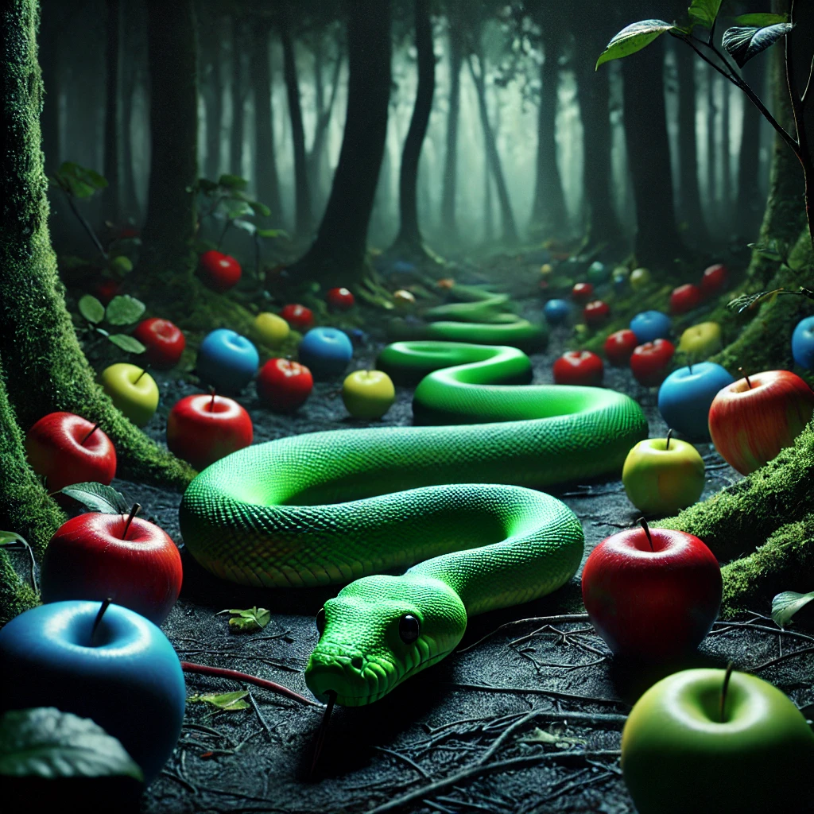

Project: Custom Snake Game in C++ using OOP (Object-Oriented Programming)

  

This project is a unique take on the classic Snake game, featuring a new rule:

The snake cannot eat the same color twice.

Through this project, I practiced Object-Oriented Programming (OOP) and worked with essential data structures like:

deque: For managing the snake's body efficiently.
vector: For storing food colors and messages.
set: For tracking occupied positions on the grid.
unordered_map: For mapping food positions to their respective colors.

I also utilized for loops (including range-based loops), while loops, and iterators to implement game logic, such
as movement, collision detection, and food consumption.

The game was developed in C++ using the Raylib library and the XCode IDE.
